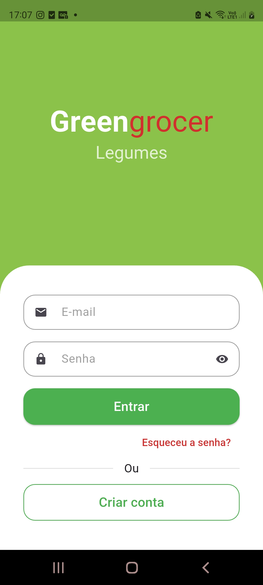
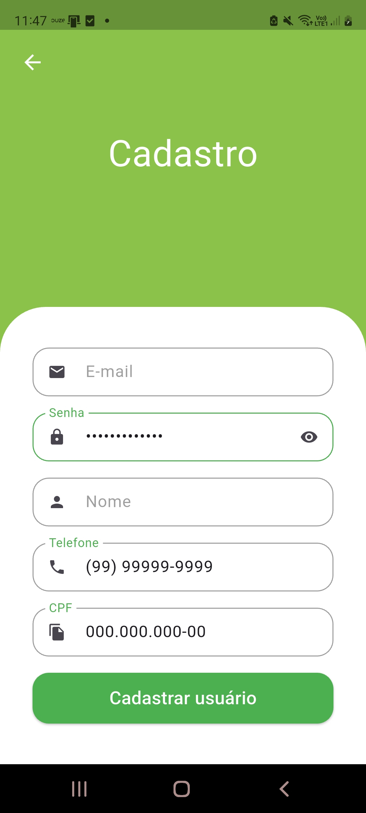
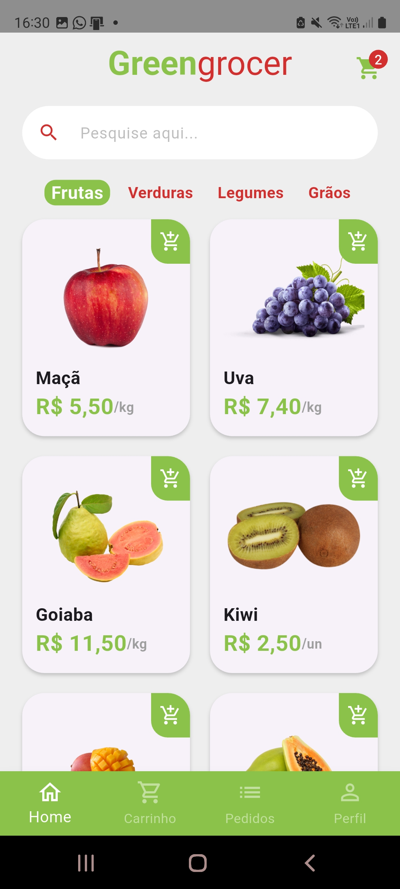
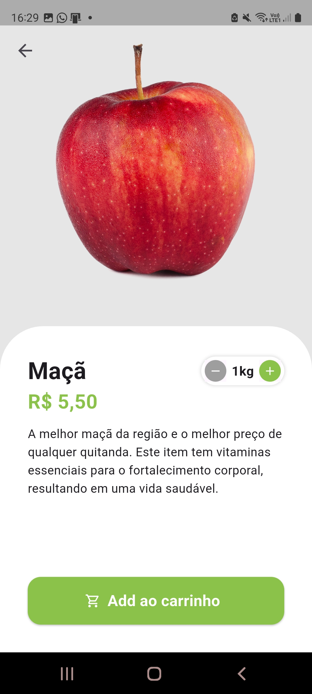
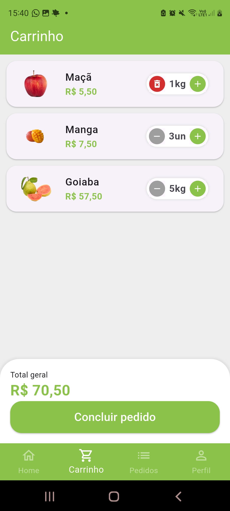
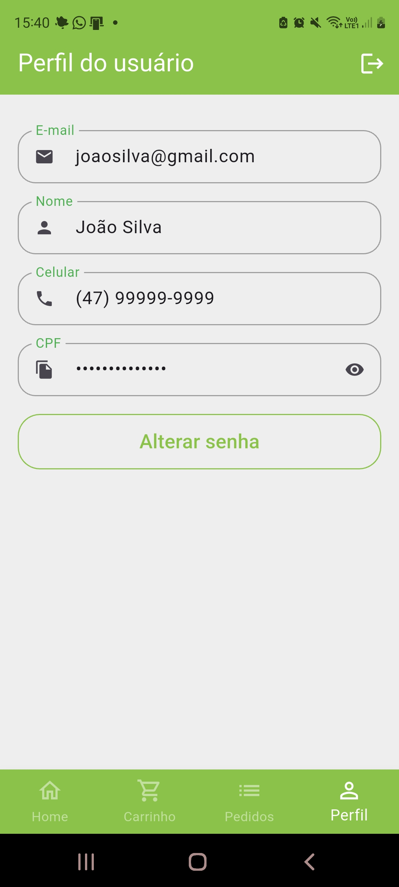

# quitanda_virtual

App de estudos do curso "Crie um App de Quitanda Virtual com Flutter + GetX" da Udemy.

## Widgets/Ferramentas Aprendidos/Aperfeiçoados

Expanded
Stack
PageView
TextField
Align
BottomNavigationBar
Text (Text.rich, TextSpan)
AnimatedTextKit
MediaQuery

## Screenshots

